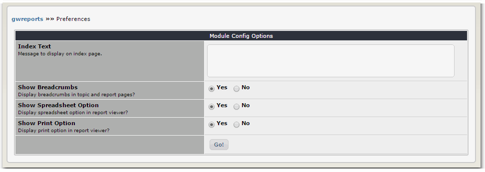

# 3.0 Preferences

**Index Text**

This is a descriptive text to display in the initial menu of a list of topics. Topic definitions can include a description which is similarly displayed, and this item allows this customization for the full menu as well.

**Show Breadcrumbs**

The presence of the breadcrumb menu system could be confusing if you are intentionally not using the menu system, and are instead using blocks or direct URLs to make reports available to the user. This option will allow you to turn off the breadcrumbs completely.

**Show Spreadsheet Option**

The spreadsheet output option on the report viewer can be disabled here. The spreadsheet option produces an HTML table which can be directly imported into most spreadsheet programs. The primary differences in output are: 
* No CMS output is included, just the report data tables. 
* HTML inside report columns is stripped 
* Sum column rows are replaced with equivalent formula definitions 

Different environments may produce different results during the import process.

**Show Print Option**

The print output option on the report viewer can be disabled here. The print option produces a simpler HTML document than the normal report viewer which is more suitable for printing. The primary differences in output are:

* No CMS output is included, just the report. 
* A simple monochrome stylesheet is applied 
* The browser print function is invoked by javascript on page load 

